# Observability
{: .no_toc }

Monitor Nivo's health and performance with Prometheus metrics and Grafana dashboards.
{: .fs-6 .fw-300 }

---

## Table of Contents
{: .no_toc .text-delta }

1. TOC
{:toc}

---

## Overview

Nivo implements comprehensive observability using the RED methodology:

| Metric | Description | Example |
|:-------|:------------|:--------|
| **R**ate | Request throughput | Requests per second per service |
| **E**rrors | Error percentage | 4xx/5xx responses |
| **D**uration | Request latency | P50, P95, P99 response times |


---

## Accessing Dashboards

### Production

| Dashboard | URL | Access |
|:----------|:----|:-------|
| Grafana | [grafana.nivomoney.com](https://grafana.nivomoney.com) | Login required |

### Local Development

```bash
# Start observability stack
make obs-up

# Or with full stack
make dev
```

| Dashboard | URL |
|:----------|:----|
| Grafana | [localhost:3003](http://localhost:3003) |
| Prometheus | [localhost:9090](http://localhost:9090) |

**Default Grafana credentials:**
```
Username: admin
Password: admin
```

---

## Mission Control Dashboard

The Mission Control dashboard provides at-a-glance visibility into the entire Nivo platform.

### Row 1: Service Health

Nine stat panels showing real-time service status:

```mermaid
graph LR
    subgraph Service Health Status
        GW[Gateway<br/>🟢 UP]
        ID[Identity<br/>🟢 UP]
        L[Ledger<br/>🟢 UP]
        RBAC[RBAC<br/>🟢 UP]
        W[Wallet<br/>🟢 UP]
        TX[Transaction<br/>🟢 UP]
        R[Risk<br/>🟢 UP]
        N[Notification<br/>🟢 UP]
        SIM[Simulation<br/>🟢 UP]
    end
```



- **Green**: Service is healthy (responding to scrapes)
- **Red**: Service is down or unhealthy

### Row 2: RED Metrics

| Panel | Query | Purpose |
|:------|:------|:--------|
| Total Request Rate | `sum(rate(http_requests_total[5m]))` | Overall throughput |
| Error Rate % | `sum(rate(http_requests_total{status=~"5.."}[5m])) / sum(rate(http_requests_total[5m])) * 100` | Error percentage |
| P99 Latency | `histogram_quantile(0.99, sum(rate(http_request_duration_seconds_bucket[5m])) by (le))` | Worst-case latency |

### Row 3: Simulation Status

For the demo simulation engine:

- Users Created
- KYC Verified
- Transactions Generated
- Total Operations
- Success Rate
- Average Delay

### Row 4: Infrastructure

| Panel | Purpose |
|:------|:--------|
| Goroutines by Service | Memory/concurrency health |
| Memory Usage by Service | Resource consumption |

### Row 5-6: Time Series

Detailed trends over time:
- Request rate by service (stacked)
- Error rate by service
- Latency percentiles (P50/P95/P99)
- Memory and goroutine trends

---

## Metrics Exposed

All services expose metrics at `/metrics` in Prometheus format.

### HTTP Metrics

```prometheus
# Request count by method, path, status
http_requests_total{method="POST", path="/api/v1/auth/login", status="200"}

# Request duration histogram
http_request_duration_seconds_bucket{le="0.1"}

# Active connections
http_connections_active
```

### Go Runtime Metrics

```prometheus
# Goroutines
go_goroutines

# Memory
go_memstats_alloc_bytes
go_memstats_heap_inuse_bytes

# GC
go_gc_duration_seconds
```

### Simulation Metrics

The simulation service exposes custom gauges:

```prometheus
# Simulation progress
nivo_simulation_users_created
nivo_simulation_kyc_verified
nivo_simulation_transactions_total
nivo_simulation_success_rate
```

---

## Alert Rules

Pre-configured alerts in `monitoring/prometheus/alerts.yml`:

| Alert | Condition | Severity |
|:------|:----------|:---------|
| ServiceDown | Service not responding for 1m | Critical |
| HighErrorRate | Error rate > 5% for 5m | Warning |
| HighLatency | P99 > 2s for 5m | Warning |
| HighMemory | Memory > 80% of limit | Warning |

### Example Alert Rule

```yaml
groups:
  - name: nivo-alerts
    rules:
      - alert: ServiceDown
        expr: up == 0
        for: 1m
        labels:
          severity: critical
        annotations:
          summary: "Service {{ $labels.job }} is down"
          description: "{{ $labels.job }} has been down for more than 1 minute"

      - alert: HighErrorRate
        expr: |
          sum(rate(http_requests_total{status=~"5.."}[5m])) by (job)
          / sum(rate(http_requests_total[5m])) by (job) > 0.05
        for: 5m
        labels:
          severity: warning
        annotations:
          summary: "High error rate on {{ $labels.job }}"
```

---

## Adding Custom Metrics

Services use the shared metrics package:

```go
import "nivo/shared/metrics"

// Initialize collector
collector := metrics.NewPrometheusCollector()

// In your handler, wrap with metrics middleware
r.Use(metrics.MetricsMiddleware(collector))

// Expose /metrics endpoint
r.Handle("/metrics", promhttp.Handler())
```

### Custom Business Metrics

```go
// Record a transaction
collector.RecordTransaction("transfer", "completed", 1500.00)

// Record wallet operation
collector.RecordWalletOperation("credit", "success")

// Record risk event
collector.RecordRiskEvent("blocked", "high_velocity")
```

---

## Prometheus Configuration

Scrape configuration in `monitoring/prometheus/prometheus.yml`:

```yaml
scrape_configs:
  - job_name: 'gateway'
    static_configs:
      - targets: ['gateway:8000']
    metrics_path: /metrics

  - job_name: 'identity'
    static_configs:
      - targets: ['identity:8080']

  - job_name: 'ledger'
    static_configs:
      - targets: ['ledger:8081']

  # ... all 9 services
```

---

## Troubleshooting

### Metrics not appearing in Grafana

1. Check Prometheus targets:
   ```bash
   curl http://localhost:9090/api/v1/targets
   ```

2. Verify service is exposing metrics:
   ```bash
   curl http://localhost:8080/metrics
   ```

3. Check Prometheus logs:
   ```bash
   docker logs nivo-prometheus
   ```

### Dashboard not loading

1. Verify Grafana is running:
   ```bash
   docker ps | grep grafana
   ```

2. Check datasource configuration in Grafana UI

3. Verify network connectivity:
   ```bash
   docker exec nivo-grafana wget -q -O - http://prometheus:9090/-/healthy
   ```

### High memory alerts

1. Check which service is consuming memory:
   - View "Memory Usage by Service" panel

2. Investigate with pprof (if enabled):
   ```bash
   go tool pprof http://localhost:8080/debug/pprof/heap
   ```

---

## Architecture


**Security notes:**
- Prometheus not exposed externally (internal network only)
- Grafana accessible via nginx reverse proxy with HTTPS
- Authentication required for Grafana access

---

## Related Documentation

- [System Architecture](/architecture) - Service overview
- [SSE Integration](/sse) - Real-time event streaming
- [Development Guide](/development) - Local setup

---

{: .fs-2 }
Observability: If you can't measure it, you can't improve it.
